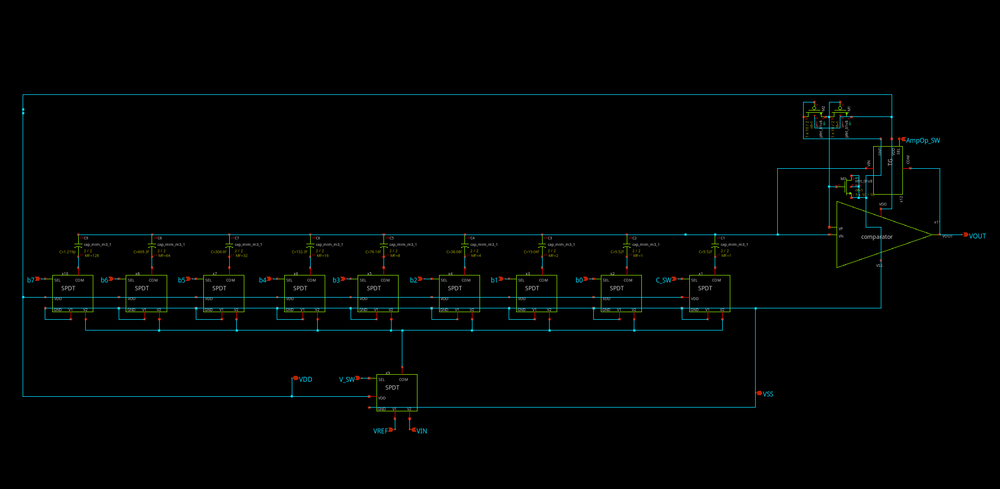

# 8-Bit Mixed-Signal SAR ADC in SkyWater 130nm

> **Disclaimer:** This project is strictly experimental and educational. It was developed as a proof-of-concept to explore Analog Mixed-Signal (AMS) verification methodologies and physical layout flows within the open-source Sky130 PDK. The current implementation does *not* satisfy commercial performance criteria (such as production-grade DNL/INL specifications or high-speed sampling rates) and is not intended for silicon fabrication as a standalone IP.

## 📌 Project Overview
This repository contains the design, simulation, and verification of an 8-bit Successive Approximation Register (SAR) Analog-to-Digital Converter (ADC), targeted for the open-source SkyWater 130nm process node. 

The primary focus of this project is to showcase advanced **Digital Design and Verification** techniques applied to mixed-signal environments. By closely coupling a digital Verilog state machine with an analog SPICE solver, the design successfully maps deep-submicron physical phenomena—such as charge injection, kickback noise, and parasitic substrate conduction—back into the digital verification flow.

## 🧱 Custom Component Architecture

To build the SAR ADC from the ground up, custom analog and mixed-signal leaf cells were designed and sized at the transistor level:

* **SPDT (Single Pole Double Throw) Switch:** The foundational routing element for the bottom-plate sampling. Sized with wider channels (`W=4`) to minimize $R_{ON}$ and reduce the RC time constant, enabling faster settling times during the bit-cycling phase.
* **TG (Transmission Gate):** Utilized exclusively for the comparator's Auto-Zero feedback loop. It was aggressively downsized to minimal dimensions to severely restrict the channel charge deposited onto the DAC's floating top plate when opening, acting as a crucial defense against static offset errors and charge injection.
* **Comparator (Continuous-Time OTA):** The decision-making core. The input differential pair was sized down to minimize gate parasitic capacitance ($\approx 20fF$), preventing massive charge-sharing (kickback noise) that would otherwise corrupt the fragile voltage stored on the capacitive array.
* **DAC Array (Capacitive Network):** The binary-weighted capacitive array is built using `cap_mim_m3_1` metal-insulator-metal capacitors. The unit capacitance was balanced to be large enough to resist comparator kickback, yet small enough to allow the SPDT switches to drive it efficiently. 

## 🧠 Digital Control & Co-Simulation

To ensure reliability at the boundary between RTL and silicon, several critical verification and design strategies were implemented:

### Digital Domain (Verilog FSM)
* **VCM-Bounded Switching Algorithm:** The standard SAR switching logic was upgraded to prevent severe Gain Errors caused by parasitic diodes. During the Hold phase, the state machine asserts `8'h80` (driving the MSB high and the rest low). This bounds the top plate voltage fluctuation within safe limits ($0V$ to $1.8V$), preventing the substrate PN junction from becoming forward-biased.
* **Synchronous 3-Phase FSM:** The controller utilizes a strict Sample, Hold, and Bit-Cycling sequence, ensuring the analog components have a dedicated, silent clock cycle to settle the charge before the first quantization step.

### AMS Verification Environment (Xyce + Icarus)
A custom co-simulation pipeline was built to perform rigorous, automated validation. The testbench stimulates the actual transistor-level netlist in tandem with the RTL.
* **Toolchain Integration:** Icarus Verilog is tightly coupled with the Xyce parallel SPICE simulator via a C/VPI wrapper, allowing cycle-accurate interaction.
* **Automated Data Logger & Scoreboard:** The Verilog testbench features a parameterized sweep that automatically extracts the transfer curve and reports pass/fail metrics natively in the terminal to evaluate linearities and static errors.

## 🚧 Current Status & Future Work
The schematic-level design and AMS verification framework are established. The project is currently transitioning into the physical implementation phase:

1. **Analog Layout:** Custom, hierarchical physical layout of the analog leaf cells and the Common-Centroid DAC array is actively being drawn and verified (DRC/LVS) using **Magic VLSI**.
2. **Digital Implementation:** The Verilog controller is being synthesized and routed using the **OpenLane/LibreLane** digital flow.
3. **Top-Level Integration:** Final mixed-signal top-level routing and post-layout parasitic extraction (PEX) validation.

## 🛠️ Tool Stack
* **Schematic Capture:** Xschem
* **Analog Simulation:** Xyce / Ngspice
* **Digital Simulation & Testbench:** Icarus Verilog
* **Physical Layout:** Magic VLSI
* **LVS/DRC:** Netgen / Magic
* **Digital Flow:** OpenLane / LibreLane
